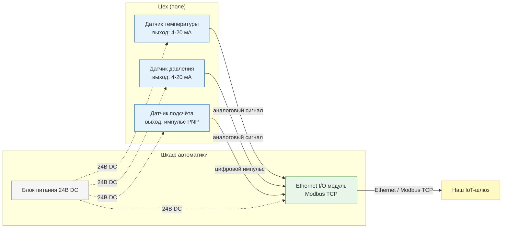
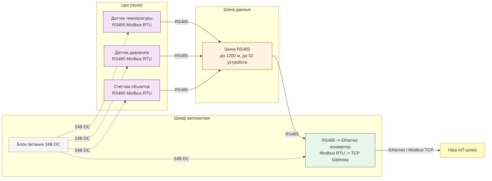
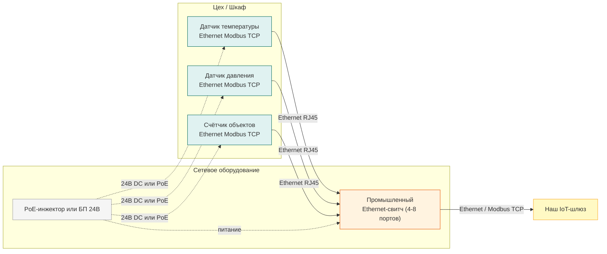
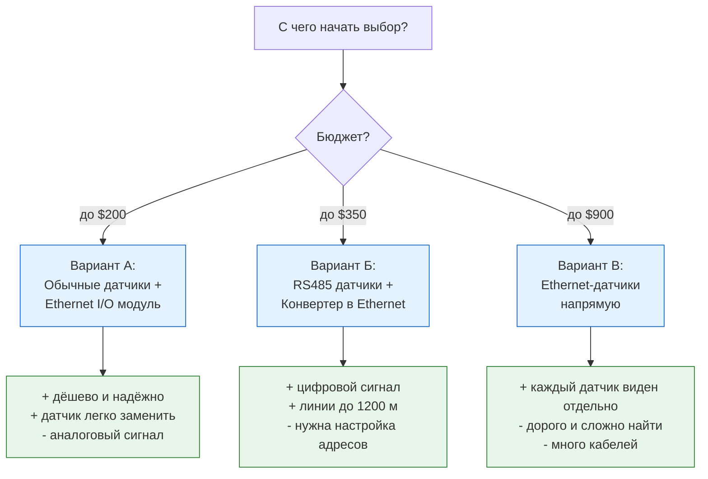

# Закупочный документ: Система мониторинга на заводе

> **Кому:** Отдел закупок  
> **Задача:** Купить датчики и сетевое оборудование для завода.  
> **Что уже есть:** IoT-шлюз на предприятии (его не покупаем, он уже наш).

---

## Что нужно измерять

| Параметр | Где | Диапазон |
|----------|-----|----------|
| Температура | На оборудовании/трубах | до +300°C |
| Давление | Гидравлическая система | уточнить у технолога |
| Подсчёт объектов | Линия конвейера | штуки в единицу времени |

Все данные должны поступать **по кабелю Ethernet** на наш IoT-шлюз.

---

## Три варианта решения

Предлагается три варианта — от дешёвого к дорогому. Разница в том, **насколько "умными" покупать датчики**.

---

### Вариант А — Бюджетный (РЕКОМЕНДУЕТСЯ)

**Суть:** Обычные дешёвые датчики + один умный модуль, который собирает все данные и отправляет по сети.

**Стоимость комплекта:** ~$130–200  
**Сложность монтажа:** Средняя (нужен электрик)  
**Надёжность:** Высокая (проверенная схема)

#### Что покупать (Вариант А)

| # | Устройство | Что сказать продавцу | Цена (Alibaba) | Ссылка на Alibaba |
|---|------------|----------------------|----------------|------------------|
| 1 | Датчик температуры | Pt100 transmitter, 0-300°C, output 4-20mA, IP67, 24V DC, stainless steel probe | $7–15 / шт | [Pt100 4-20mA temperature transmitter](https://www.alibaba.com/showroom/pt100-temperature-sensor-4-20ma-transmitter.html) |
| 2 | Датчик давления | Pressure transducer, hydraulic oil, 0-250bar, output 4-20mA, G1/4 thread, IP65, 24V DC | $17–38 / шт | [Hydraulic pressure sensor 4-20mA 250bar](https://www.alibaba.com/showroom/hydraulic-pressure-sensor.html) |
| 3 | Датчик подсчёта (фотоэлектрический) | Photoelectric sensor, PNP output, response time <5ms, IP67, 12-24V DC, through-beam or diffuse | $5–15 / шт | [Photoelectric sensor PNP NPN IP67](https://www.alibaba.com/showroom/photoelectric-sensor-pnp-npn.html) |
| 4 | Ethernet I/O модуль | Ethernet I/O module, Modbus TCP server, 2x analog input 4-20mA, 2x digital input, DIN rail, 24V DC | $40–80 / шт | [CWT Ethernet Modbus TCP I/O модуль DIN](https://www.alibaba.com/product-detail/CWT-Ethernet-Modbus-Tcp-Io-Module_1600061833688.html) |
| 5 | Блок питания 24В DC | DIN rail power supply, 24V DC, 2.5A/5A, industrial | $10–20 / шт | [DIN rail power supply 24V industrial](https://www.alibaba.com/showroom/din-rail-power-supply.html) |

---

### Вариант Б — Средний

**Суть:** Датчики с цифровым выходом RS485 + конвертер RS485→Ethernet.

**Стоимость комплекта:** ~$200–350  
**Сложность монтажа:** Средняя (нужна настройка адресов устройств)  
**Преимущество:** Цифровой сигнал — точнее, меньше помех на длинных линиях

> **Важно для закупок по Варианту Б:** У каждого датчика на шине должен быть уникальный адрес (1, 2, 3...). Уточните у продавца: **"Можно ли вручную задать Modbus address? Какой адрес по умолчанию?"**

#### Что покупать (Вариант Б)

| # | Устройство | Что сказать продавцу | Цена (Alibaba) | Ссылка на Alibaba |
|---|------------|----------------------|----------------|------------------|
| 1 | Датчик температуры (RS485) | Temperature transmitter, RS485 Modbus RTU, 0-300°C, configurable address, IP65, 24V DC | $15–30 / шт | [RS485 Modbus temperature transmitter](https://www.alibaba.com/showroom/4--20ma-pt100-temperature-transmitter.html) |
| 2 | Датчик давления (RS485) | Pressure sensor, RS485 Modbus RTU, hydraulic, 250bar, configurable address, IP65 | $32–50 / шт | [GAMICOS GPT200 RS485 Modbus hydraulic](https://www.alibaba.com/product-detail/4-20ma-Hydrostatic-250-Air-Fuel_62552393000.html) |
| 3 | Счётчик объектов (RS485) | Photoelectric counter, RS485 Modbus RTU output, PNP, IP67, DIN rail display (optional) | $20–50 / шт | [Through-beam sensor для конвейера](https://www.alibaba.com/showroom/through-beam-sensor.html) |
| 4 | Конвертер RS485→Ethernet | RS485 to Ethernet converter, Modbus RTU to TCP gateway, DIN rail, 24V DC | $10–24 / шт | [PUSR USR-DR134 Modbus RTU→TCP DIN rail](https://www.alibaba.com/product-detail/PUSR-DIN-Rail-RS485-to-Ethernet_1601117538174.html) |
| 5 | Блок питания 24В DC | DIN rail power supply, 24V DC, 5A | $10–20 / шт | [DIN rail power supply 24V industrial](https://www.alibaba.com/showroom/din-rail-power-supply.html) |

---

### Вариант В — Премиум

**Суть:** Каждый датчик напрямую подключается по Ethernet — никаких промежуточных конвертеров.

**Стоимость комплекта:** ~$500–900  
**Сложность монтажа:** Высокая (каждый датчик нужно настраивать отдельно)  
**Преимущество:** Легкая диагностика, каждый датчик виден отдельно в сети

#### Что покупать (Вариант В)

| # | Устройство | Что сказать продавцу | Цена (Alibaba) | Ссылка на Alibaba |
|---|------------|----------------------|----------------|------------------|
| 1 | Датчик температуры (Ethernet) | Temperature sensor, Ethernet RJ45, Modbus TCP, 0-300°C, industrial, IP65 | $80–150 / шт | [Ethernet Modbus TCP temperature sensor](https://www.alibaba.com/showroom/pt100-din-rail-temperature-transmitter.html) |
| 2 | Датчик давления (Ethernet) | Pressure transmitter, Ethernet Modbus TCP, hydraulic, IP65, configurable IP address | $100–200 / шт | [Ethernet Modbus TCP pressure transmitter](https://www.alibaba.com/showroom/pressure-sensor-4-20ma-output.html) |
| 3 | Счётчик объектов (Ethernet) | Industrial counter, Ethernet Modbus TCP, photoelectric, conveyor | $80–150 / шт | [Industrial Modbus TCP IO module](https://www.alibaba.com/product-detail/Modbus-Ethernet-industrial-remote-IO-module-1600279544285.html) |
| 4 | Промышленный свитч | Industrial Ethernet switch, 4-8 port, DIN rail, 24V DC, -40°C to +75°C | $30–80 / шт | [Industrial ethernet switch DIN rail 24V](https://www.alibaba.com/showroom/industrial-ethernet-switch.html) |

---

## Сравнение вариантов

| | Вариант А | Вариант Б | Вариант В |
|---|-----------|-----------|-----------|
| **Стоимость** | ~$130–200 | ~$200–350 | ~$500–900 |
| **Сложность** | Низкая | Средняя | Высокая |
| **Точность** | Средняя | Высокая | Высокая |
| **Найти в продаже** | Легко | Средне | Сложно |
| **Рекомендуется** | ✅ Да | Возможно | Нет (если нет опыта) |

---

## Что проверить при заказе (чек-лист для продавца)

### Обязательные вопросы для **любого** датчика:
1. **"Какой выходной сигнал?"** — нужен 4-20мА, RS485 или Ethernet (в зависимости от варианта)
2. **"Какая защита корпуса?"** — не ниже **IP65** (для работы в цеху)
3. **"Какое питание?"** — должно быть **24В DC**
4. **"Есть ли сертификат CE?"** — нужен для ввоза

### Для Ethernet/RS485 устройств дополнительно:
5. **"Поддерживает ли Modbus TCP (или RTU)?"** — обязательно
6. **"Пришлите таблицу Modbus-регистров (Modbus Map)"** — нужно для подключения к шлюзу
7. **"Поддерживает ли Function Code 03 (Read Holding Registers)?"** — обязательно

### Для конвертера RS485→Ethernet (Вариант Б):
8. **"Это шлюз Modbus RTU to TCP, или просто прозрачный конвертер?"** — нужен именно **Modbus Gateway**

---

## Конкретные модели для поиска на Alibaba

| Тип | Ссылка | Примерная цена |
|-----|--------|----------------|
| Датчик температуры Pt100, 4-20мА | [Pt100 4-20mA transmitter 300C stainless](https://www.alibaba.com/product-detail/4-20ma-Transmitter-3-Wire-4_1600519118806.html) | $7–15 |
| Датчик давления, 4-20мА | [Hydraulic pressure sensor 4-20mA 250bar](https://www.alibaba.com/product-detail/4-20ma-Hydrostatic-250-Air-Fuel_62552393000.html) | $17–38 |
| Датчик давления, RS485 (GAMICOS GPT200) | [GPT200 RS485 Modbus hydraulic pressure](https://www.alibaba.com/showroom/pressure-sensor-250bar.html) | $32–50 |
| Фотоэлектрический датчик-счётчик, PNP/NPN | [Photoelectric sensor PNP NPN IP67 conveyor](https://www.alibaba.com/showroom/photoelectric-sensor-pnp-npn.html) | $5–15 |
| Фотоэлектрический, барьерный (through-beam) | [Through beam sensor industrial IP67](https://www.alibaba.com/showroom/through-beam-sensor.html) | $8–20 |
| Ethernet I/O модуль (CWT, Modbus TCP) | [CWT Ethernet Modbus TCP IO module DIN rail](https://www.alibaba.com/product-detail/CWT-Ethernet-Modbus-Tcp-Io-Module_1600061833688.html) | $40–80 |
| Конвертер RS485→Ethernet (PUSR USR-DR134) | [PUSR DIN Rail RS485→Ethernet Modbus gateway](https://www.alibaba.com/product-detail/PUSR-DIN-Rail-RS485-to-Ethernet_1601117538174.html) | $10–15 |
| Конвертер RS485→Ethernet (USR-DR302) | [USR-DR302 Modbus RTU to TCP DIN rail](https://www.alibaba.com/product-detail/USR-DR302-DIN-RAIL-RS485-to_1600558248484.html) | $20–24 |
| Промышленный свитч | [Industrial ethernet switch DIN rail 24V](https://www.alibaba.com/showroom/industrial-ethernet-switch.html) | $30–80 |
| Блок питания DIN 24В DC | [DIN rail power supply 24V 5A industrial](https://www.alibaba.com/showroom/din-rail-power-supply.html) | $10–20 |

---

## Итоговая рекомендация

> Начать с **Варианта А**: купить обычные аналоговые датчики (Pt100 + датчик давления 4-20мА + фотоэлектрический счётчик PNP) и один Ethernet I/O модуль с Modbus TCP. Это самый дешёвый, надёжный и распространённый вариант. Датчики легко заменить в случае поломки — любой промышленный поставщик такое держит на складе.

---
**См. также:** [Бизнес-требования](requirements.md) | [← Навигация](../index.md)
